# Activity Hub - Application Activity Diagrams

## Overview

**Activity Hub** is a Laravel-based activity management system with three roles:

| Role                 | Description                                                        |
| -------------------- | ------------------------------------------------------------------ |
| **Admin**            | Manages users, companies, and can delete any activity              |
| **Dosen** (Lecturer) | Reviews and approves/rejects activities, browses by company → user |
| **User** (Student)   | Creates activities, requests to join a company                     |

### Entity Relationship

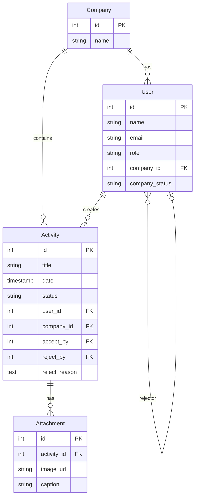

---

## 1. Authentication Flow

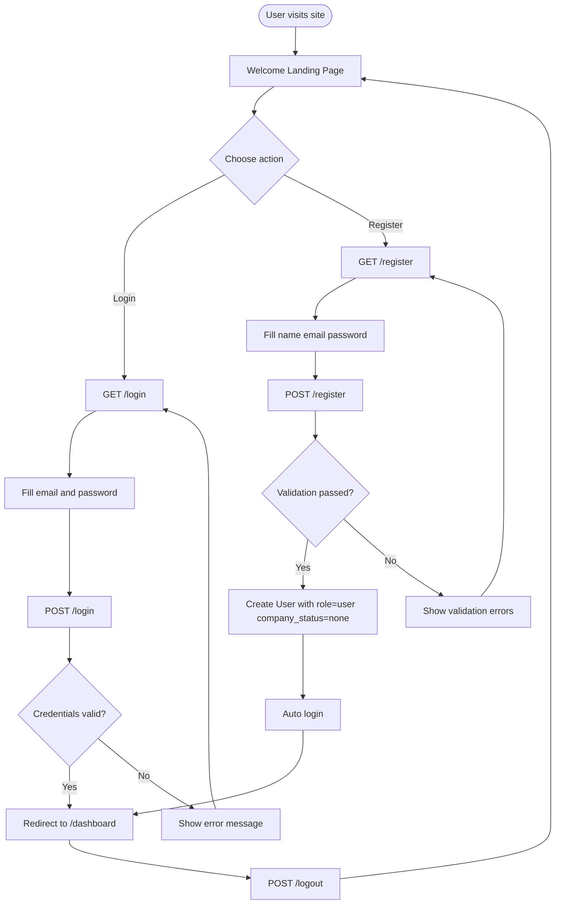

---

## 2. Company Join Request Flow

When a new user registers, their `company_status` is `none`. They must request to join a company before they can create activities.

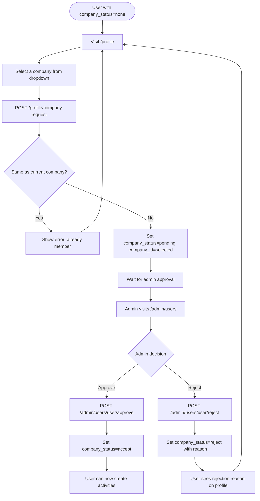

---

## 3. Activity Lifecycle (Core Flow)

This is the central workflow of the application. Activities go through three statuses: `pending` → `accept` or `reject`.

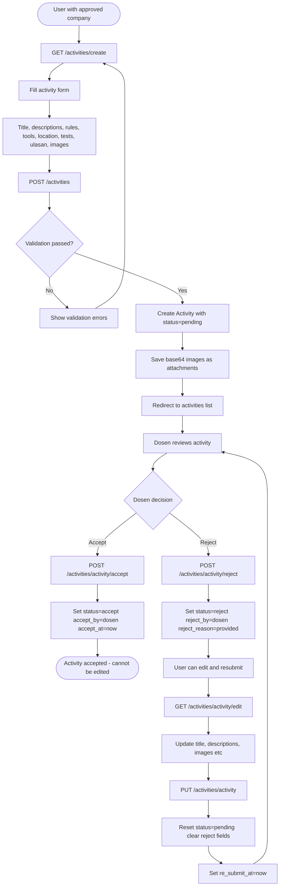

---

## 4. Activity Deletion Flow

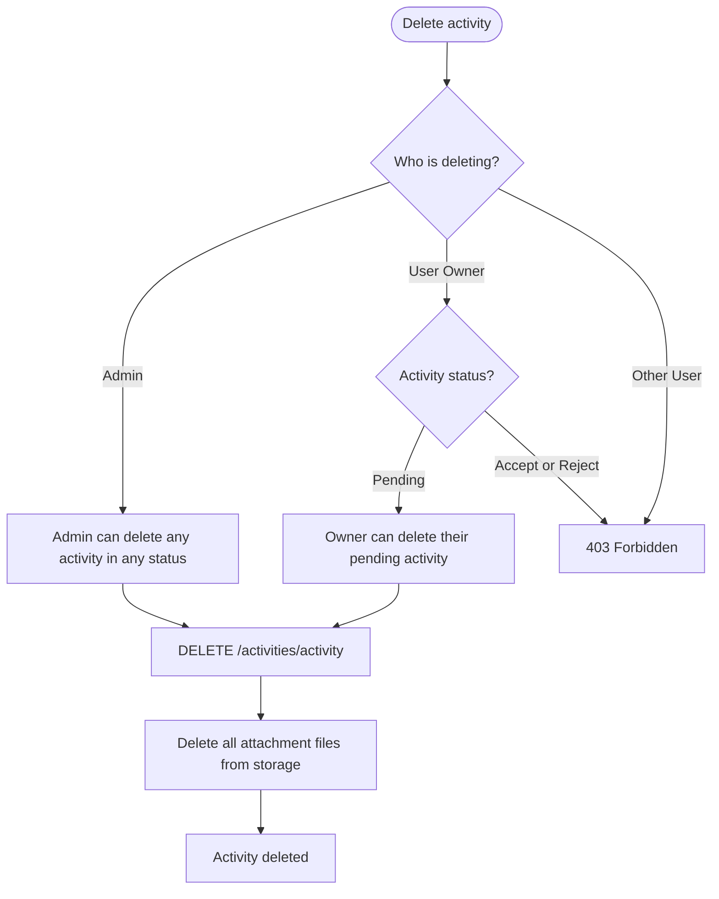

---

## 5. Dosen Browsing Flow

Dosen has a unique hierarchical browsing experience: Company → User → Activities

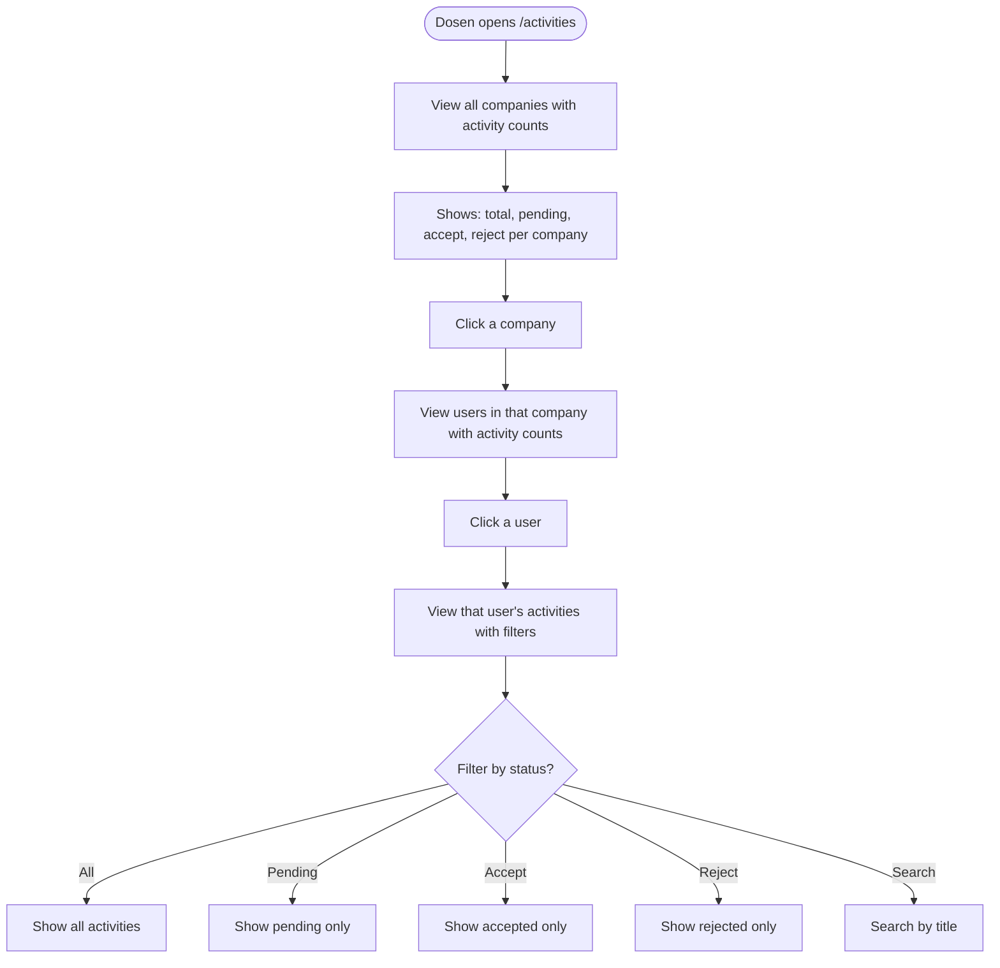

---

## 6. Activity Status State Machine

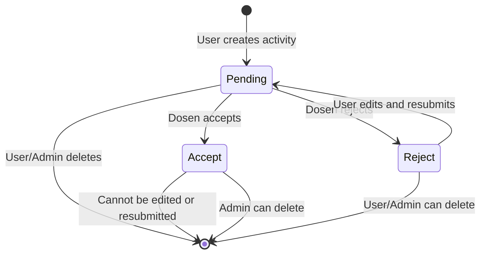

---

## 7. Admin Management Flows

### 7a. User Management

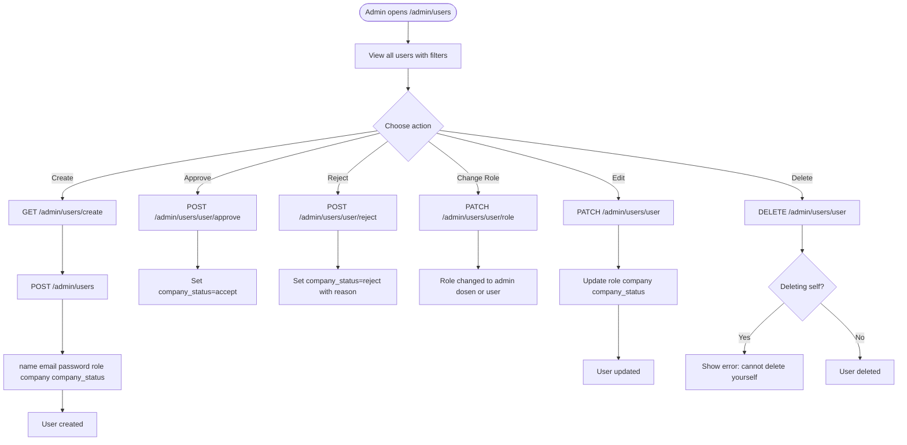

### 7b. Company Management

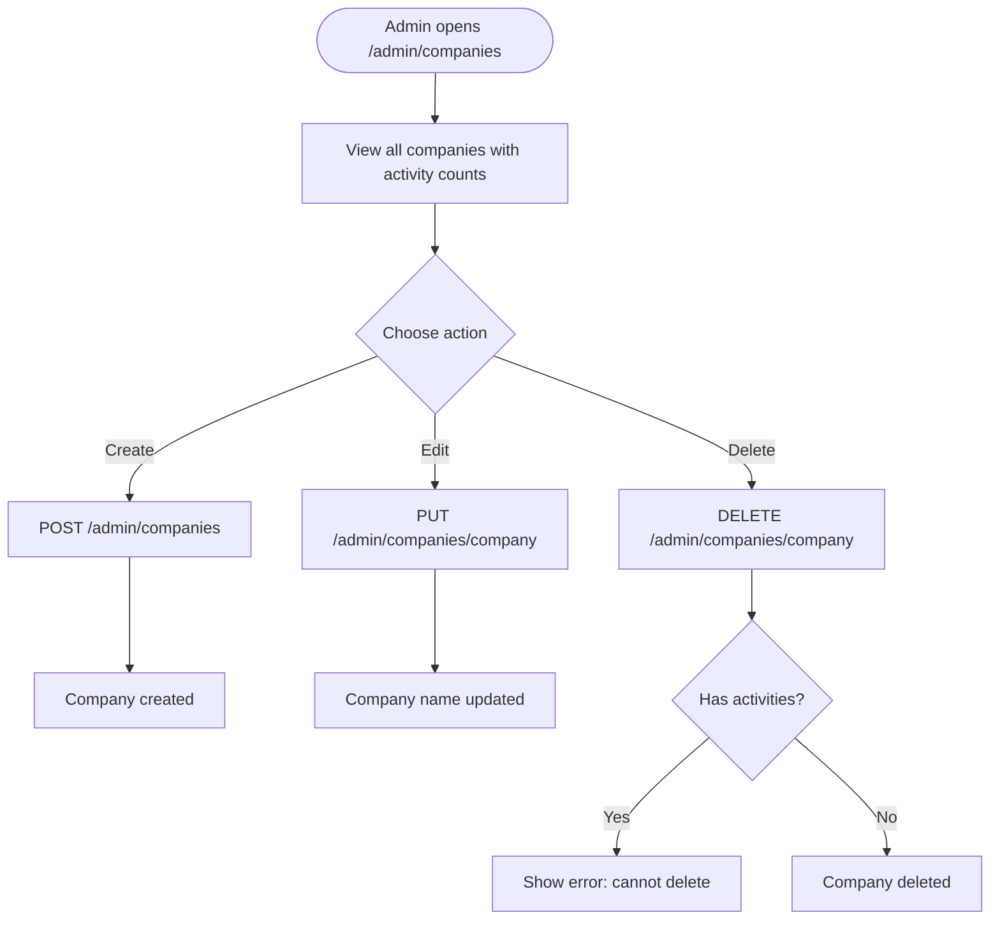

---

## 8. Dashboard Flow

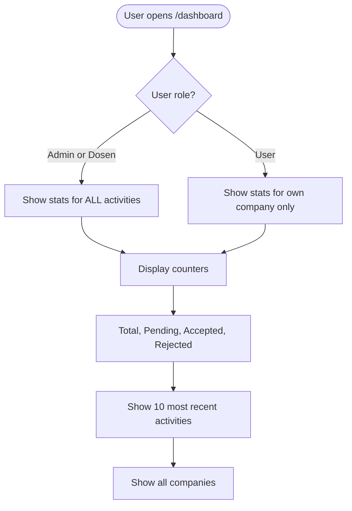

---

## 9. Calendar Flow

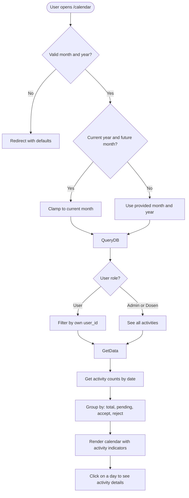

---

## 10. PDF Report Flow

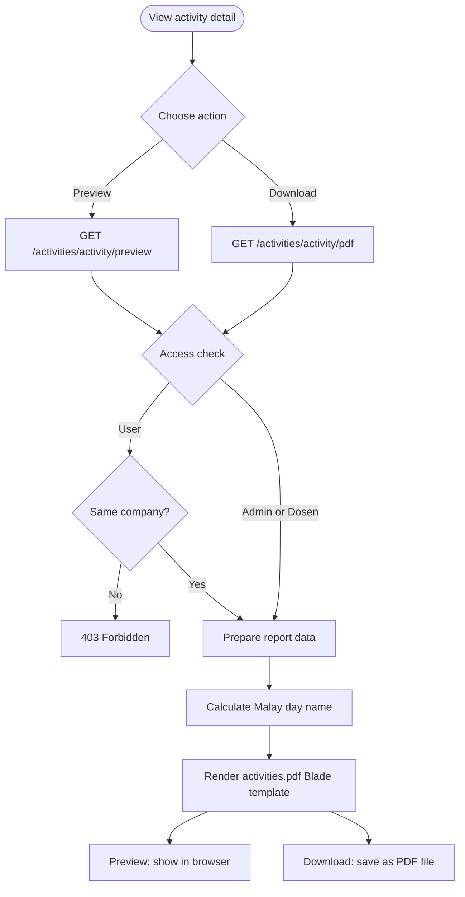

---

## 11. Profile Management Flow

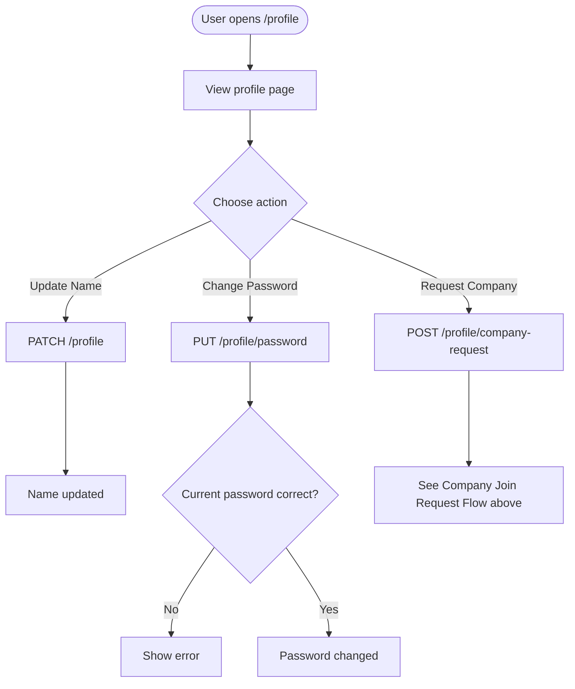

---

## 12. Complete System Overview

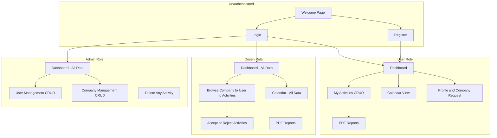
