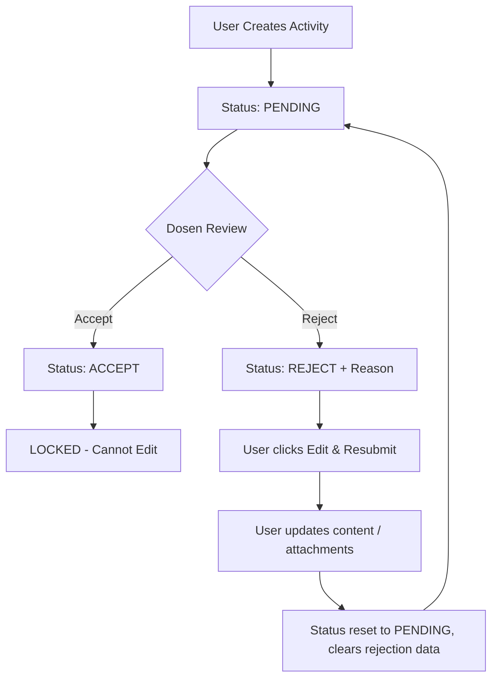

# Activity Management System — Architecture & Implementation Documentation

## Overview

The **Activity Management System** is a PHP/MySQL web application for managing company activities, reviews, and activity submission workflows. Users create activities targeted for their assigned company, while Lecturers (Dosen) review (Accept/Reject with reasons) activities. Admin manages users, approvals, and companies.

---

## Tech Stack

- **Backend**: PHP 8.3+ / Laravel 13.x (Eloquent ORM)
- **Database**: MySQL (via Laravel database migrations & Eloquent)
- **Frontend**: HTML5, CSS3, Tailwind CSS 4 + Vite 8
- **Build Tool**: Vite with `laravel-vite-plugin`
- **Image Processing**: Cropper.js (CDN) for client-side multi-image cropping & preview
- **Authentication**: Laravel built-in Auth (session-based)

---

## Data Model & Schema

### `companies`

| Field        | Type            | Description           |
| ------------ | --------------- | --------------------- |
| `id`         | bigint (PK, AI) | Primary key           |
| `name`       | varchar(255)    | Company name (unique) |
| `created_at` | timestamp       | Creation timestamp    |
| `updated_at` | timestamp       | Update timestamp      |

### `users`

| Field                   | Type                            | Description                                       |
| ----------------------- | ------------------------------- | ------------------------------------------------- |
| `id`                    | bigint (PK, AI)                 | Primary key                                       |
| `name`                  | varchar(255)                    | Full name                                         |
| `email`                 | varchar(255)                    | Email address (unique)                            |
| `email_verified_at`     | timestamp (nullable)            | Email verification timestamp                      |
| `password`              | varchar(255)                    | Hashed password                                   |
| `company_status`        | varchar(255), default 'pending' | Company approval status (pending, accept, reject) |
| `company_reject_reason` | text (nullable)                 | Rejection reason for company join                 |
| `company_reject_at`     | timestamp (nullable)            | Timestamp of company rejection                    |
| `company_accept_at`     | timestamp (nullable)            | Timestamp of company acceptance                   |
| `company_id`            | bigint (nullable)               | Associated company ID                             |
| `role`                  | varchar(255), default 'user'    | User role (user, dosen, admin)                    |
| `company_accept_by`     | bigint (nullable)               | User ID who accepted company join                 |
| `company_reject_by`     | bigint (nullable)               | User ID who rejected company join                 |
| `remember_token`        | varchar(100)                    | Remember me token                                 |
| `created_at`            | timestamp                       | Creation timestamp                                |
| `updated_at`            | timestamp                       | Update timestamp                                  |

### `password_reset_tokens`

| Field        | Type                 | Description         |
| ------------ | -------------------- | ------------------- |
| `email`      | varchar(255) (PK)    | User email          |
| `token`      | varchar(255)         | Reset token         |
| `created_at` | timestamp (nullable) | Token creation time |

### `sessions`

| Field           | Type                       | Description             |
| --------------- | -------------------------- | ----------------------- |
| `id`            | varchar(255) (PK)          | Session ID              |
| `user_id`       | bigint (nullable, indexed) | Associated user         |
| `ip_address`    | varchar(45) (nullable)     | Client IP address       |
| `user_agent`    | text (nullable)            | Browser user agent      |
| `payload`       | longtext                   | Session payload         |
| `last_activity` | int (indexed)              | Last activity timestamp |

### `activities`

| Field           | Type                                              | Description                               |
| --------------- | ------------------------------------------------- | ----------------------------------------- |
| `id`            | bigint (PK, AI)                                   | Primary key                               |
| `date`          | timestamp (default now)                           | Activity date                             |
| `title`         | varchar(255)                                      | Activity title                            |
| `descriptions`  | text (nullable)                                   | Main activity description                 |
| `rules`         | text (nullable)                                   | Rules / guidelines                        |
| `tools`         | text (nullable)                                   | Required tools / equipment                |
| `user_id`       | bigint (FK → users.id, cascade delete)            | Creator user ID                           |
| `company_id`    | bigint (FK → companies.id, nullable, null delete) | Target company                            |
| `status`        | varchar(255), default 'pending'                   | Activity status (pending, accept, reject) |
| `accept_by`     | bigint (FK → users.id, nullable, null delete)     | User who accepted                         |
| `reject_by`     | bigint (FK → users.id, nullable, null delete)     | User who rejected                         |
| `reject_reason` | text (nullable)                                   | Rejection explanation (if reject)         |
| `reject_at`     | timestamp (nullable)                              | Rejection timestamp                       |
| `accept_at`     | timestamp (nullable)                              | Acceptance timestamp                      |
| `re_submit_at`  | timestamp (nullable)                              | Re-submission timestamp                   |
| `created_at`    | timestamp                                         | Creation timestamp                        |
| `updated_at`    | timestamp                                         | Update timestamp                          |

### `attachments`

| Field        | Type            | Description              |
| ------------ | --------------- | ------------------------ |
| `id`         | bigint (PK, AI) | Primary key              |
| `caption`    | varchar(255)    | Attachment caption/title |
| `image_url`  | varchar(255)    | File path / URL          |
| `created_at` | timestamp       | Creation timestamp       |
| `updated_at` | timestamp       | Update timestamp         |

---

## Roles & Access Control Rules

### Admin

- **Full Management**: Approve/reject pending users (`users.php`), manage companies (`companies.php`).
- **Activity Control**: View all activities, delete activities, edit `pending` and `reject` activities.
- **Restrictions**: Cannot edit activities that are `accept` (locked).

### Dosen (Lecturer)

- **Review Activities**: Review `pending` activities with **Accept** or **Reject** (with required rejection reason modal).
- **View All**: View all activities across companies.
- **Edit Access**: Edit/resubmit activities created by them if status is `pending` or `reject`.

### User (Active + Linked Company)

- **Create Activity**: Create new activities automatically mapped to their assigned company (`company_id`).
- **View Company Activities**: View all activities for their company.
- **Edit & Resubmit**: Edit activities for their company when status is `pending` or `reject`.
- **Restrictions**:
    - Blocked from editing `accept` activities.
    - Cannot access creation page if status is `pending` or `company_id` is missing.

---

## Activity Lifecycle & Resubmit Rules



1. **Pending**:
    - Editable by creator, company user, or admin.
2. **Accept (Approved)**:
    - **LOCKED**. Edit button is hidden across `activities.php` and `activity-detail.php`.
    - Direct edit URL access (`create-activity.php?edit=ID`) is blocked with a flash alert.
3. **Reject (Rejected)**:
    - Displays rejection reason card in `activity-detail.php`.
    - Shows prominent yellow **"Edit & Resubmit"** button in `activities.php` and `activity-detail.php`.
    - Saving changes automatically resets `status` to `pending` and clears `reject_reason`, `reject_by`, and `reject_at`.

---

## Attachments & Image Processing

- Built-in multi-file image uploader with **Cropper.js** integration.
- Allows users to crop/aspect-ratio adjust each uploaded photo and add specific captions.
- Images are encoded as base64, decoded on backend, saved as physical files in `uploads/`, and tracked in `attachments`.
- Existing attachments can be re-captioned or individually checked for deletion during edit mode.

---

## Layout & Mobile Responsiveness

- Fixed overlay sidebar on screens `< 992px` with blur backdrop (`sidebarBackdrop`).
- Inline JavaScript `toggleSidebar()` function declared in `header.php` to prevent undefined reference errors before page load.
- Body scroll locking (`body.sidebar-open`) while mobile navigation drawer is active.
- Desktop sidebar state (`sidebar-collapsed`) stored in `localStorage`.

---

## Application File Map

```
activity-hub/
├── app/
│   ├── Http/
│   │   └── Controllers/       # Route controllers
│   ├── Models/
│   │   ├── Activity.php       # Activity Eloquent model
│   │   ├── Attachment.php     # Attachment Eloquent model
│   │   ├── Company.php        # Company Eloquent model
│   │   └── User.php           # User Eloquent model (Auth)
│   └── Providers/
│       └── AppServiceProvider.php
├── config/                    # Laravel configuration files
├── database/
│   ├── factories/             # Model factories for testing
│   ├── migrations/            # Database schema migrations
│   └── seeders/               # Database seeders
├── plans/
│   └── activity-system-plan.md # This documentation
├── public/
│   └── index.php              # Application entry point
├── resources/
│   ├── css/
│   │   └── app.css            # Tailwind CSS entry
│   ├── js/
│   │   └── app.js             # JS entry point
│   └── views/
│       └── welcome.blade.php  # Blade templates
├── routes/
│   ├── web.php                # Web routes
│   └── console.php            # Artisan commands
├── storage/                   # Logs, cache, sessions, compiled views
├── tests/                     # PHPUnit tests
├── artisan                    # CLI entry point
├── composer.json              # PHP dependencies
├── package.json               # Node dependencies (Tailwind, Vite)
├── vite.config.js             # Vite build configuration
└── phpunit.xml                # Test configuration
```
