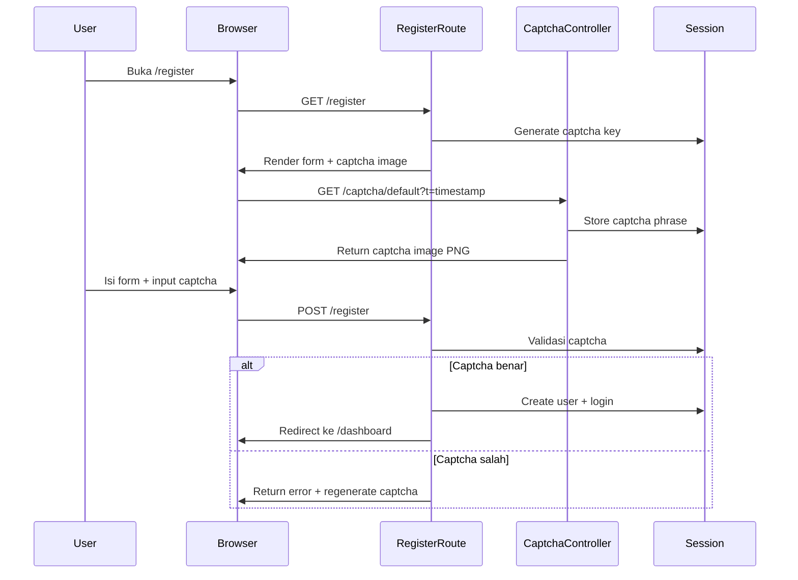

# Image Captcha Implementation Plan — Registration Form

## Overview

Implementasi captcha gambar self-hosted menggunakan package `mews/captcha` pada form registrasi Activity Hub. Tujuan: mencegah bot spam tanpa dependency layanan eksternal.

## Architecture Diagram



## Component Changes

```mermaid
graph LR
    subgraph Existing
        RC[RegisterController]
        RV[register.blade.php]
        RG[routes/web.php]
        CSS[app.css]
    end

    subgraph New
        CP[config/captcha.php]
        CR[/captcha route]
    end

    CP -->|config| RC
    CP -->|config| CR
    CR -->|image| RV
    RC -->|validate| RV
```

---

## Step-by-Step Implementation

### Step 1: Install Package `mews/captcha`

```bash
composer require mews/captcha
```

Package ini otomatis ter-register via Laravel auto-discovery.

### Step 2: Publish Konfigurasi

```bash
php artisan vendor:publish --provider="Mews\Captcha\CaptchaServiceProvider"
```

File yang dihasilkan: [`config/captcha.php`](config/captcha.php)

Konfigurasi utama yang perlu disesuaikan:

- `default` → `'default'`
- `characters` → `['2', '3', '4', '6', '7', '8', '9', 'a', 'b', 'c', 'd', 'e', 'f', 'g', 'h', 'j', 'm', 'n', 'p', 'q', 'r', 't', 'u', 'x', 'y', 'z']` (hilangkan karakter ambigu seperti 0/O, 1/l/I, 5/S)
- `default.length` → `5`
- `default.width` → `150`
- `default.height` → `40`
- `default.bgColor` → `#ffffff`
- `default.fontSize` → `18`

### Step 3: Tambahkan Route Captcha Image

Package `mews/captcha` mendaftarkan route secara otomatis. Pastikan route `/captcha/{config?}` tersedia dengan meng-register service provider. Jika tidak auto-register, tambahkan manual di [`routes/web.php`](routes/web.php):

```php
Route::get('/captcha/{config?}', function ($config = 'default') {
    return app('captcha')->create($config);
})->name('captcha.generate');
```

> **Note:** Route ini harus berada di luar group `guest` middleware karena captcha image perlu diakses tanpa autentikasi.

### Step 4: Modifikasi [`RegisterController.php`](app/Http/Controllers/Auth/RegisterController.php)

Tambahkan validasi captcha pada method `store()`:

```php
public function store(Request $request)
{
    $validated = $request->validate([
        'name'     => ['required', 'string', 'max:255'],
        'email'    => ['required', 'string', 'email', 'max:255', 'unique:users'],
        'password' => ['required', 'string', 'min:8', 'confirmed'],
        'captcha'  => ['required', 'captcha'],  // ← Tambah ini
    ]);

    // ... sisa kode tetap sama
}
```

Custom error message (opsional) bisa ditambahkan:

```php
'captcha' => ['required', 'captcha'],
```

dengan custom message di `resources/lang/id/validation.php`:

```php
'captcha' => 'Kode captcha yang Anda masukkan salah.',
```

### Step 5: Modifikasi [`register.blade.php`](resources/views/auth/register.blade.php)

Tambahkan elemen captcha sebelum tombol submit:

```blade
{{-- Captcha --}}
<div class="mb-4">
    <label for="captcha" class="form-label">Verification Code</label>
    <div class="captcha-wrapper">
        <div class="captcha-image-container">
            
            <button type="button" class="captcha-refresh" id="captcha-refresh" title="Refresh captcha">
                <i class="bi bi-arrow-clockwise"></i>
            </button>
        </div>
        <input type="text" class="form-control @error('captcha') is-invalid @enderror"
               id="captcha" name="captcha" placeholder="Enter the code above" required autocomplete="off">
        @error('captcha')
            <div class="invalid-feedback">{{ $message }}</div>
        @enderror
    </div>
</div>
```

### Step 6: Tambahkan CSS Styling

Tambahkan di [`resources/css/app.css`](resources/css/app.css) agar sesuai dengan design system yang ada:

```css
/* ============================================
   CAPTCHA
   ============================================ */
.captcha-wrapper {
    display: flex;
    flex-direction: column;
    gap: 0.5rem;
}

.captcha-image-container {
    display: flex;
    align-items: center;
    gap: 0.5rem;
}

.captcha-image {
    height: 40px;
    border-radius: var(--radius-md);
    border: 1px solid var(--border-color);
    background: var(--bg-input);
    cursor: pointer;
    transition: border-color var(--transition-fast);
}

.captcha-image:hover {
    border-color: var(--primary-light);
}

.captcha-refresh {
    width: 36px;
    height: 36px;
    border-radius: var(--radius-md);
    border: 1px solid var(--border-color);
    background: var(--bg-card);
    color: var(--text-secondary);
    display: flex;
    align-items: center;
    justify-content: center;
    cursor: pointer;
    transition: all var(--transition-fast);
    flex-shrink: 0;
    font-size: 1rem;
}

.captcha-refresh:hover {
    background: rgba(99, 102, 241, 0.08);
    color: var(--primary);
    border-color: var(--primary-light);
}

.captcha-refresh:active {
    transform: rotate(180deg);
}
```

### Step 7: Tambahkan JavaScript Refresh Captcha

Tambahkan di `@push('scripts')` pada [`register.blade.php`](resources/views/auth/register.blade.php):

```javascript
// Captcha refresh
document.getElementById('captcha-refresh').addEventListener('click', function () {
    refreshCaptcha();
});

document.getElementById('captcha-image').addEventListener('click', function () {
    refreshCaptcha();
});

function refreshCaptcha() {
    const img = document.getElementById('captcha-image');
    img.src = '{{ captcha_src('default') }}?' + Date.now();
}
```

Parameter `?timestamp` mencegah browser caching sehingga captcha baru selalu di-fetch dari server.

### Step 8: Testing

- [ ] Buka `/register`, captcha image tampil dengan benar
- [ ] Klik tombol refresh, captcha berubah
- [ ] Submit form dengan captcha salah → error message muncul
- [ ] Submit form dengan captcha benar → registrasi berhasil
- [ ] Pastikan captcha refresh otomatis setelah error validation

---

## Files Modified

| File                                                                                                   | Action | Description                                   |
| ------------------------------------------------------------------------------------------------------ | ------ | --------------------------------------------- |
| [`composer.json`](composer.json)                                                                       | Modify | Tambah dependency `mews/captcha`              |
| [`config/captcha.php`](config/captcha.php)                                                             | Create | Konfigurasi captcha (published)               |
| [`routes/web.php`](routes/web.php)                                                                     | Modify | Tambah captcha route jika tidak auto-register |
| [`app/Http/Controllers/Auth/RegisterController.php`](app/Http/Controllers/Auth/RegisterController.php) | Modify | Tambah validasi `captcha` rule                |
| [`resources/views/auth/register.blade.php`](resources/views/auth/register.blade.php)                   | Modify | Tambah UI captcha + refresh JS                |
| [`resources/css/app.css`](resources/css/app.css)                                                       | Modify | Tambah captcha styling                        |

## Dependencies

- PHP GD extension (biasanya sudah enabled di Laragon)
- `mews/captcha` package

## Notes

- Captcha disimpan di session, sehingga kompatibel dengan `SESSION_DRIVER=database` yang digunakan project ini
- Karakter yang ambigu (0/O, 1/l/I, 5/S) dihilangkan untuk UX yang lebih baik
- Captcha bersifat case-insensitive secara default
- Tidak ada dependency layanan eksternal — seluruhnya berjalan lokal
