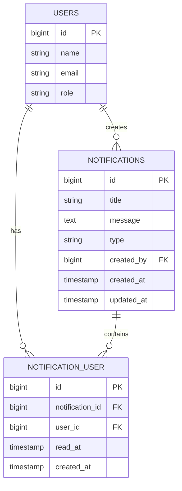
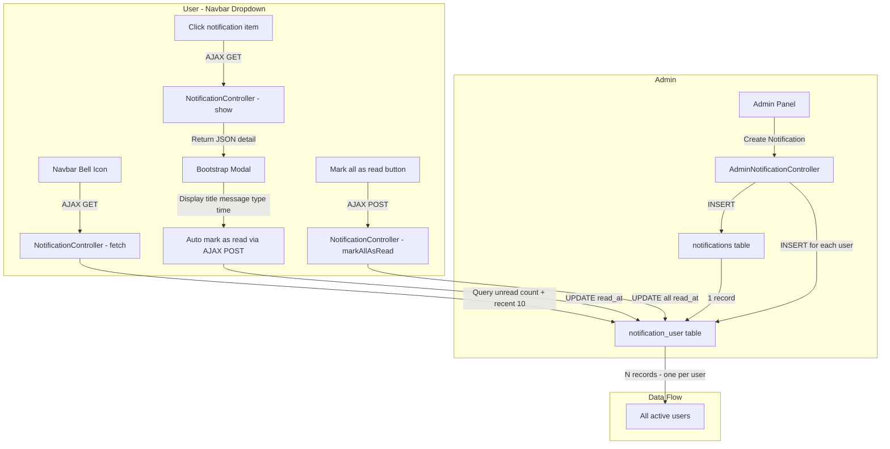

# Notification System Plan

## Requirements Summary

- **Broadcast only**: Admin creates one notification, sent to all users simultaneously
- **Content**: Title + message (text only, no links/redirects)
- **UI**: Dropdown in navbar (replacing existing placeholder at line 14 of `navbar.blade.php`)
- **Permission**: Only `admin` role can create/manage notifications
- **Read tracking**: Track which users have read each notification
- **Detail modal**: Click notification in dropdown → open Bootstrap modal showing full detail (title, message, type badge, time) fetched via AJAX, auto-marks as read

---

## Database Schema Design

### ERD - Notification System



### Table 1: `notifications`

Stores the notification content. One record per notification created by admin.

| Column       | Type                        | Description                                        |
| ------------ | --------------------------- | -------------------------------------------------- |
| `id`         | bigint (PK, auto-increment) | Primary key                                        |
| `title`      | string                      | Notification title/headline                        |
| `message`    | text                        | Notification body/message                          |
| `type`       | string, default: `info`     | Type badge: `info`, `warning`, `success`, `danger` |
| `created_by` | bigint (FK → users.id)      | Admin who created the notification                 |
| `created_at` | timestamp                   | Auto-managed by Laravel                            |
| `updated_at` | timestamp                   | Auto-managed by Laravel                            |

### Table 2: `notification_user` (Pivot)

Tracks per-user read status. One row per user per notification.

| Column            | Type                                           | Description                                     |
| ----------------- | ---------------------------------------------- | ----------------------------------------------- |
| `id`              | bigint (PK, auto-increment)                    | Primary key                                     |
| `notification_id` | bigint (FK → notifications.id, cascade delete) | Reference to notification                       |
| `user_id`         | bigint (FK → users.id, cascade delete)         | Reference to user                               |
| `read_at`         | timestamp, nullable                            | When user read the notification (null = unread) |
| `created_at`      | timestamp                                      | When the notification was delivered             |

---

## Architecture Overview



---

## Implementation Steps

### Step 1: Database Migrations

**Migration 1: `create_notifications_table`**

```
notifications
├── id (bigint, PK, auto-increment)
├── title (string)
├── message (text)
├── type (string, default: 'info')
├── created_by (bigint, FK → users.id, nullable on delete)
├── timestamps
```

**Migration 2: `create_notification_user_table`**

```
notification_user
├── id (bigint, PK, auto-increment)
├── notification_id (bigint, FK → notifications.id, cascade delete)
├── user_id (bigint, FK → users.id, cascade delete)
├── read_at (timestamp, nullable)
├── created_at (timestamp)
```

### Step 2: Models

**Create `app/Models/Notification.php`**

- Relationships:
    - `createdBy()` → `belongsTo(User::class, 'created_by')`
    - `users()` → `belongsToMany(User::class)->withPivot('read_at')->withTimestamps()`
- Scopes:
    - `scopeOfType($query, $type)` → filter by type
- Accessors:
    - `getIsReadForCurrentUserAttribute()` → check pivot read_at

**Update `app/Models/User.php`**

- Add relationship:
    - `notifications()` → `belongsToMany(Notification::class)->withPivot('read_at')->withTimestamps()`
    - `unreadNotifications()` → `belongsToMany(Notification::class)->wherePivotNull('read_at')->withTimestamps()`

### Step 3: Controller - Admin Side

**Create `app/Http/Controllers/Admin/NotificationController.php`**

| Method      | Route                                        | Description                                        |
| ----------- | -------------------------------------------- | -------------------------------------------------- |
| `index()`   | `GET /admin/notifications`                   | List all notifications sent by admin               |
| `create()`  | `GET /admin/notifications/create`            | Show create notification form                      |
| `store()`   | `POST /admin/notifications`                  | Create notification + broadcast to all users       |
| `destroy()` | `DELETE /admin/notifications/{notification}` | Delete a notification (cascade removes pivot rows) |

**Store logic:**

1. Validate input (title required, message required, type in allowed values)
2. Create `Notification` record with `created_by = auth()->id()`
3. Fetch all active users (exclude admin themselves)
4. Create `notification_user` pivot records in bulk for all users

### Step 4: Controller - User/AJAX Side

**Create `app/Http/Controllers/NotificationController.php`**

| Method            | Route                               | Description                                                 |
| ----------------- | ----------------------------------- | ----------------------------------------------------------- |
| `fetch()`         | `GET /api/notifications`            | Return JSON: unread count + last 10 notifications           |
| `show()`          | `GET /api/notifications/{id}`       | Return JSON: single notification detail + auto mark as read |
| `markAsRead()`    | `POST /api/notifications/{id}/read` | Mark single notification as read                            |
| `markAllAsRead()` | `POST /api/notifications/read-all`  | Mark all notifications as read                              |

**`show()` logic:**

1. Find notification by ID, verify current user has a pivot record
2. Return JSON with: id, title, message, type, created_by name, created_at
3. Auto-set `read_at` on the pivot record if not already read

### Step 5: Routes

Add to `routes/web.php`:

```php
// Admin notification routes (inside admin prefix group with role:admin middleware)
Route::resource('notifications', NotificationController::class)->only(['index', 'create', 'store', 'destroy']);

// API notification routes (inside auth group, accessible by all authenticated users)
Route::get('/api/notifications', [App\Http\Controllers\NotificationController::class, 'fetch']);
Route::get('/api/notifications/{id}', [App\Http\Controllers\NotificationController::class, 'show']);
Route::post('/api/notifications/{id}/read', [App\Http\Controllers\NotificationController::class, 'markAsRead']);
Route::post('/api/notifications/read-all', [App\Http\Controllers\NotificationController::class, 'markAllAsRead']);
```

### Step 6: Admin Views

**`resources/views/admin/notifications/index.blade.php`**

- Table listing all sent notifications
- Columns: Title, Message preview, Type badge, Created at, Actions (delete)
- "Create Notification" button at top

**`resources/views/admin/notifications/create.blade.php`**

- Form with fields: Title, Message (textarea), Type (select: info/warning/success/danger)
- Preview section showing how it will look in the dropdown
- Submit button: "Send to All Users"

### Step 7: Navbar Notification Dropdown + Detail Modal

Replace the placeholder at [`resources/views/partials/navbar.blade.php:14-17`](resources/views/partials/navbar.blade.php:14) with:

**Dropdown:**

- Bell icon with unread count badge (dynamically updated via JS)
- Dropdown panel showing last 10 notifications
- Each notification shows: type icon/color, title, message preview max 80 chars, time ago, unread dot indicator
- "Mark all as read" link at top of dropdown
- Notifications load via AJAX on dropdown open

**Detail Modal** (Bootstrap 5 modal appended to page body):

- When user clicks a notification item in dropdown:
    1. Close dropdown
    2. Fire AJAX `GET /api/notifications/{id}` to fetch detail
    3. Open modal with: type badge, full title, full message, sent by admin name, time ago
    4. Response auto-marks notification as read on server side
    5. Update badge count and remove unread indicator on the clicked item
- Modal layout:
    - Header: type badge color + title
    - Body: full message text
    - Footer: sent by admin name + timestamp + close button

### Step 8: Sidebar Menu Item

Add to [`resources/views/partials/sidebar.blade.php`](resources/views/partials/sidebar.blade.php) inside the admin section:

```
Notifications (admin only)
├── Icon: bi-bell-fill
├── Route: admin.notifications.index
├── Active check: request()->routeIs('admin.notifications.*')
```

---

## File Changes Summary

| Action | File Path                                                                      |
| ------ | ------------------------------------------------------------------------------ |
| CREATE | `database/migrations/xxxx_create_notifications_table.php`                      |
| CREATE | `database/migrations/xxxx_create_notification_user_table.php`                  |
| CREATE | `app/Models/Notification.php`                                                  |
| MODIFY | `app/Models/User.php` (add relationships)                                      |
| CREATE | `app/Http/Controllers/Admin/NotificationController.php`                        |
| CREATE | `app/Http/Controllers/NotificationController.php`                              |
| MODIFY | `routes/web.php` (add routes)                                                  |
| CREATE | `resources/views/admin/notifications/index.blade.php`                          |
| CREATE | `resources/views/admin/notifications/create.blade.php`                         |
| MODIFY | `resources/views/partials/navbar.blade.php` (replace notification placeholder) |
| MODIFY | `resources/views/partials/sidebar.blade.php` (add admin menu item)             |
